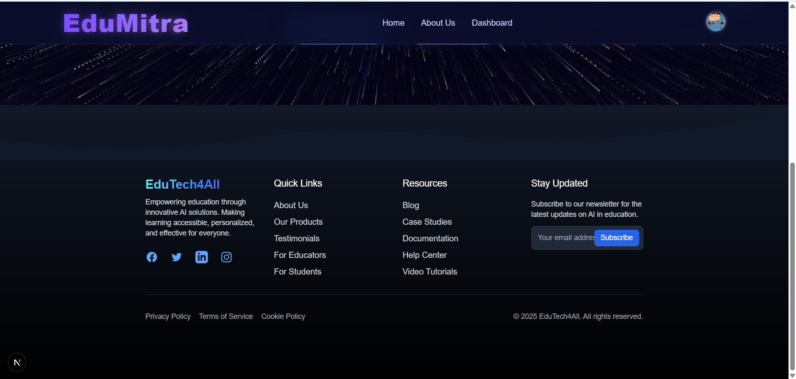
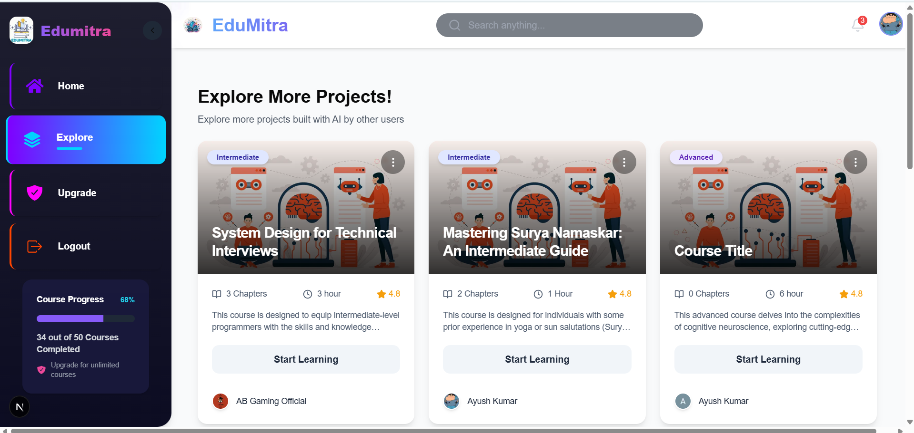
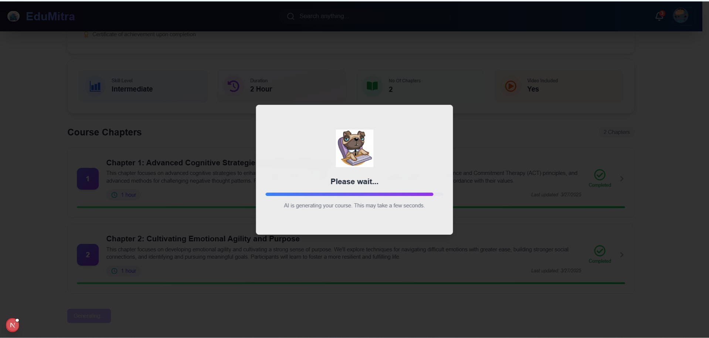
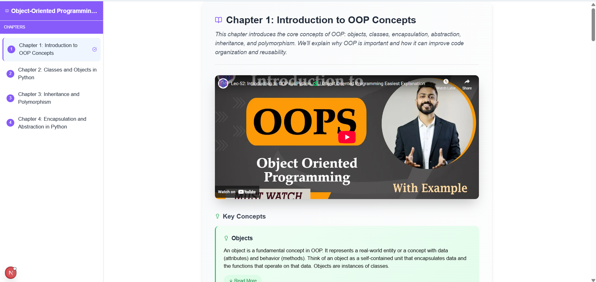
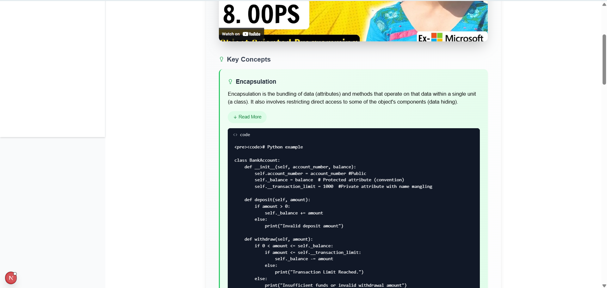

🚀 EduMitra: AI-Powered Personalized Learning Platform
🌟 Project Overview
EduMitra is a revolutionary web application that transforms the way people learn by leveraging cutting-edge AI technology to create personalized, engaging learning experiences.

🎯 Problem Statement
Traditional learning platforms often:

Offer one-size-fits-all content
Lack personalization
Require jumping between multiple resources
Don't adapt to individual learning paces

✨ Solution: EduMitra
EduMitra solves these challenges by:

🧠 Generating AI-powered, personalized course content
📚 Creating custom learning paths
🎥 Aggregating relevant video lessons
🚀 Providing a distraction-free learning environment

🖼️ Application Screenshots

  
  
  
  
  
  
  
  

🛠️ Tech Stack
CategoryTechnologiesFrontendNext.js 14, React, Tailwind CSSBackendNext.js App Router, Server-Side RenderingAuthenticationClerkDatabaseNeon, Drizzle ORMAI IntegrationGoogle Gemini AIDeploymentVercel

🌈 Key Features

🤖 AI-Powered Course Generation
🎨 Personalized Learning Paths
📽️ Intelligent Video Content Aggregation
🔒 Secure User Authentication
📊 Scalable Database Management

🚀 Quick Start
Prerequisites

Node.js 18.x+
npm or yarn
Google Gemini API Key
Clerk Account
Neon Database

Installation Steps

Clone the repository

bash git clone https://github.com/ayushkumar1991/edumitra.git
cd edumitra

Install dependencies

bash npm install

Create .env file

bashCopy# Database Connection
DATABASE_URL=your_neon_database_url

# Authentication
NEXT_PUBLIC_CLERK_PUBLISHABLE_KEY=your_clerk_key
CLERK_SECRET_KEY=your_clerk_secret_key

# AI Integration
GEMINI_API_KEY=your_gemini_api_key

Run the development server

bash npm run dev
📂 Project Structure
Copy├── /components       # Reusable React components
├── /app              # Next.js routing and pages
├── /db               # Database schemas and models
├── /hooks            # Custom React hooks
├── /lib              # Utility functions
├── /public           # Static assets
└── /styles           # Global styles
🔮 Future Roadmap

 Multi-language course support
 Comprehensive progress tracking
 Interactive quizzes and assessments
 Offline learning mode
 Advanced AI course recommendations

🤝 Contributing
Contributions are welcome! Please follow these steps:

Fork the repository
Create your feature branch (git checkout -b feature/AmazingFeature)
Commit your changes (git commit -m 'Add some AmazingFeature')
Push to the branch (git push origin feature/AmazingFeature)
Open a Pull Request

📞 Contact & Support
Ayush Kumar

💼 LinkedIn: Ayush Kumar
🐱 GitHub: @ayushkumar1991
✉️ Email: ayushkumar1991@gmail.com

📄 License
Distributed under the MIT License. See LICENSE for more information.

🌟 Star the Repository if you find it helpful! 🌟